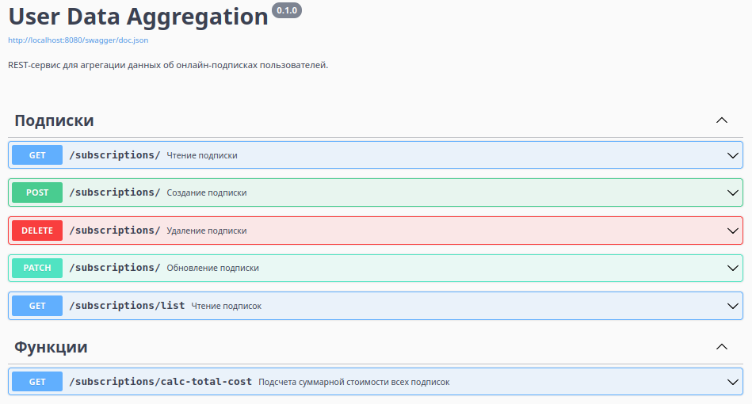

# User Data Aggregation

REST-сервис для агрегации данных об онлайн-подписках пользователей. [ТЗ](./_readme/TestTask.pdf)

### Скачивание проекта
```bash
git clone \
  --single-branch \
  --depth=1 \
  https://github.com/ames0k0/TT--Golang--User-Data-Aggregation

cd TT--Golang--User-Data-Aggregation
```

### Запуск проекта (Docker Compose)
<details>
  <summary>Зависимости</summary>
  <pre>Docker version 27.5.1, build 9f9e405</pre>
</details>

```bash
docker compose up -d --build
```
| Сервис                        | Документация / SwaggerUI                  |
| ----------------------------- | ----------------------------------------- |
| http://localhost:8080/        | http://localhost:8080/swagger             |

### Остановка проекта и удаление
- Docker-образов, Docker-контейнеров, Хранилище, Сети
```bash
docker compose down --volumes --rmi local
```

<details>
<summary>Использованные технологии</summary>

| Название       | Ссылка                                     |
| -------------- | ------------------------------------------ |
| Golang         | https://go.dev/                            |
| goose          | https://pressly.github.io/goose            |
| pgx            | https://pkg.go.dev/github.com/jackc/pgx/v5 |
| http-swagger   | https://github.com/swaggo/http-swagger     |
| Docker         | https://docs.docker.com                    |
| Docker Compose | https://docs.docker.com/compose            |

</details>

---

<p align="center"></p>